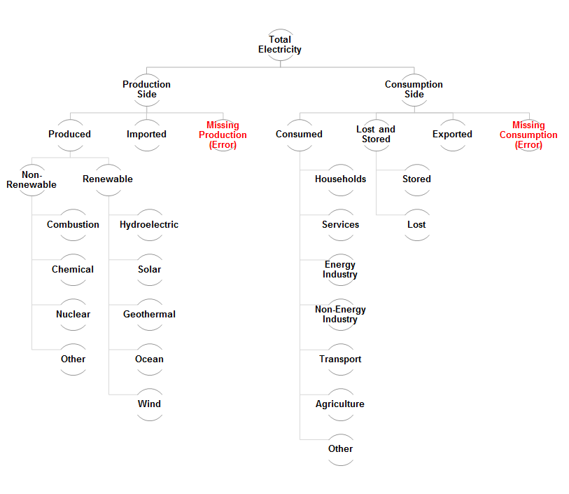

## Electricity Data Cleaning

Data source: [UN Data](http://data.un.org/Explorer.aspx)

### Load libraries and read in data

3 files were created with additional codes and labels. These files were used to aggregate country data into regions, format country names, add a shorter description to the 'Transaction', and add labels requiered for our visualization.

```{r}
# Load libraries
library(reshape2)
library(plyr)

# Read input files
# Electricity raw data
raw_data <- read.csv( "electricity_raw_data.csv", stringsAsFactors=FALSE) 

# The following .csv files were created to clean and add lables to the raw data
# grouping of countries according to UN Regions
country <- read.csv( "codes_country.csv", stringsAsFactors=FALSE)             
# shorter description for the column 'transaction'
description <- read.csv( "codes_description.csv", stringsAsFactors=FALSE)
# Labels for categories of the visualization
categories <- read.csv( "codes_categories.csv", stringsAsFactors=FALSE)

```

### Clean Data

- Shorten description of units from 'Kilowatt-hours, million' to 'million kWh'
- Make all missing values (NA) 0
- Format country names in 'country' data frame to match the country names in raw_data 

``` {r, echo=FALSE}
# Edit Units and convert NAs to 0
raw_data$Unit <- "million kWh"
raw_data[is.na(raw_data)] <- 0

# Format the original country names in 'country' raw_data frame to match column names in raw_data
country$OrigCountryName <- gsub(" ", ".", country$OrigCountryName)
country$OrigCountryName <- gsub(",", ".", country$OrigCountryName)
country$OrigCountryName <- gsub('\\(', ".", country$OrigCountryName)
country$OrigCountryName <- gsub(")", ".", country$OrigCountryName)
country$OrigCountryName <- gsub("'", ".", country$OrigCountryName)
country$OrigCountryName <- gsub("-", ".", country$OrigCountryName)
country$OrigCountryName <- gsub("©", ".", country$OrigCountryName)
country$OrigCountryName <- gsub("´", ".", country$OrigCountryName)

```


Join the following countries together:

- Czech Republic with Czechoslovakia (former)
- Ethiopia with Ethiopia,incl.Eritrea
- Germany with German D.R.(former) and Germany(Fed.Rep.)
- Russian Federation with USSR (former)
- Serbia with Serbia and Montenegro
- Yemen with Yemen (former) and Dem. Yemen (former)

And remove the following countries:

- Yugoslavia, SFR
- Other Asia
- Pacific Islands (Trust Territory)

```{r, echo=FALSE}
# Aggregate countries that change politically but are geographically the same or similar to their current state
raw_data$Czech.Republic <- raw_data$Czech.Republic + raw_data$Czechoslovakia.former.
raw_data$Ethiopia <- raw_data$Ethiopia + raw_data$Ethiopia.incl.Eritrea
raw_data$Germany <- raw_data$Germany + raw_data$German.D.R..former. + raw_data$Germany.Fed.Rep..
raw_data$Russian.Federation <- raw_data$Russian.Federation + raw_data$USSR..former.
raw_data$Serbia <- raw_data$Serbia + raw_data$Serbia.and.Montenegro
raw_data$Yemen <- raw_data$Yemen + raw_data$Dem..Yemen..former. + raw_data$Yemen..former.

# Remove countries
raw_data$Czechoslovakia.former. <- NULL
raw_data$Ethiopia.incl.Eritrea <- NULL
raw_data$German.D.R..former. <- NULL
raw_data$Germany.Fed.Rep.. <- NULL
raw_data$Other.Asia <- NULL
raw_data$Pacific.Islands..Trust.Territory.  <- NULL
raw_data$USSR..former. <- NULL
raw_data$Serbia.and.Montenegro <- NULL
raw_data$Yemen..former. <- NULL
raw_data$Dem..Yemen..former. <- NULL
raw_data$Yugoslavia..SFR <- NULL

```

Grouped countries by region according to the [United Nations Statistics Division](http://unstats.un.org/unsd/methods/m49/m49regin.htm).

The final dataset contains the following aggregates: sub-continents, continents, world (all countries), and develop/developing countries.

The sub-continents are:

-     Eastern Africa
-	Middle Africa
-	Northern Africa
-	Southern Africa
-	Western Africa
-	Caribbean
-	Central America
-	South America
-	Northern America
-	Central Asia
-	Eastern Asia
-	Southern Asia
-	South-Eastern Asia
-	Western Asia
-	Eastern Europe
-	Northern Europe
-	Southern Europe
-	Western Europe
-	Australia and New Zealand
-	Melanesia
-	Micronesia
-	Polynesia

The continents are:

-     Africa
-	Americas
-	Asia
-	Europe
-	Oceania


```{r , echo=FALSE}
# Change format of data frame 
data <- melt(raw_data,id=c("Transaction", "Year", "Unit"), variable.name = "LongCountry")

# Merge with short description (to substitute Transaction)
data <- merge(description, data, by.x="Original", by.y="Transaction")

# Merge with SubContinend and Continent data
data <- merge(data, country, by.x="LongCountry", by.y="OrigCountryName")

# Remove columns that will not be used
data <- data[,c("Description","Year","Unit","value","Country","SubContinent","Continent","Develop")]

# Reshape data to have value (usage) and population as independent columns
data <- dcast(data, Year+Unit+Country+SubContinent+Continent+Develop ~ Description, sum)
data <- melt(data,id=c("Year","Unit","Country","SubContinent","Continent","Develop", "population"), variable.name = "Description")

data$Description <- as.character(data$Description)

# GROUP COUNTRIES
# Aggregate by Sub Continent
subCont_data <- ddply(data, .(Year,Unit,Description,SubContinent), summarize, population = sum(population), value=sum(value))

# Aggregate by Continent
cont_data <- ddply(data, .(Year,Unit,Description,Continent), summarize, population = sum(population), value=sum(value))

# Aggregate total World
world_data <- ddply(data, .(Year,Unit,Description), summarize, population = sum(population), value=sum(value))
world_data$Country <- 'World'
world_data <- world_data[,c(1,2,3,6,4,5)]

# Aggregate by develop/developing countries
develop_data <- ddply(data, .(Year,Unit,Description,Develop), summarize, population = sum(population), value=sum(value))

# Format columns before merging
data <- data[,c("Year","Unit", "Description", "Country", "population", "value")]
names(subCont_data) <- c("Year","Unit", "Description", "Country", "population", "value")
names(cont_data) <- c("Year","Unit", "Description", "Country", "population", "value")
names(develop_data) <- c("Year","Unit", "Description", "Country", "population", "value")
names(world_data) <- c("Year","Unit", "Description", "Country", "population", "value")

# Merge all data
data <- rbind(data, subCont_data, cont_data, develop_data, world_data)

```

And finally, the categories and aggregates that were missing for the visualization were added.

The final data set looks like this:

```{r, echo=FALSE}
# re-format data frame to add calculated columns
data <- dcast(data, Year + Unit + Country + population ~ Description)
data[is.na(data)] <- 0

# Add calculated columns
data <- ddply(data, .(Year, Country),  mutate, 
           chemical = chem_auto_add + chem_main_add,
           combustion = comb_auto_add + comb_main_add,
           prod_other = other_auto_add + other_main_add,
           lost_stored = stored + lost,
           energy_ind = own_use_1 + own_use_2,
           consumed = energy_ind+non_energy_ind+transport+household+services+agri+cons_other,
           tot_consumption = consumed + lost_stored + exported,
           tot_production = produced + imported,
           electricity = max(tot_consumption, tot_production),
           prod_error = electricity - tot_production,
           cons_error = electricity - tot_consumption
           )

# remove excess columns that were only needed calculations
data$chem_auto_add <- NULL
data$chem_main_add <- NULL
data$comb_auto_add <- NULL
data$comb_main_add <- NULL
data$other_auto_add <- NULL
data$other_main_add <- NULL
data$own_use_1 <- NULL
data$own_use_2 <- NULL

data <- melt(data,id=c("Country", "Year", "Unit", "population"), variable.name = "Description")
data$Description <- as.character(data$Description)

# Add additional labels and groups
data <- merge(categories, data, by.x="Description", by.y="Description")
head(data)

```

Some final notes:

- 'Country' contains groups like 'world', 'Africa', and 'developing' which are not really countries.
- Nuclear was grouped as 'Non-Renewable'
- I did not aggregate renewable and non-renewable categories

And the category heirarchy is as follows:



### Write Cleaned Data

```{r}
write.csv(data, file = "electricity_data.csv",row.names=FALSE)
```